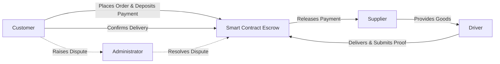
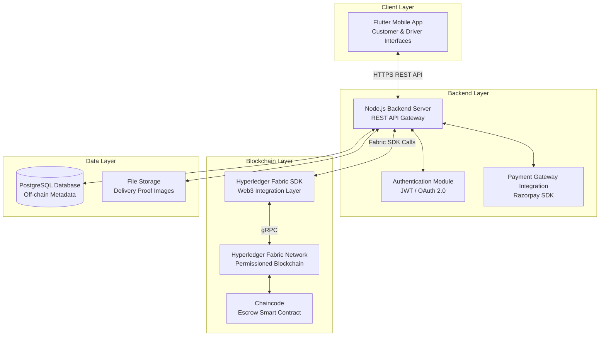
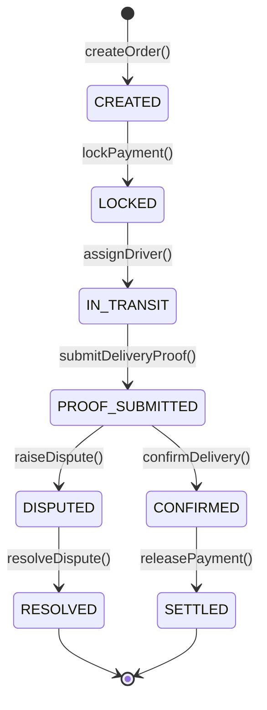
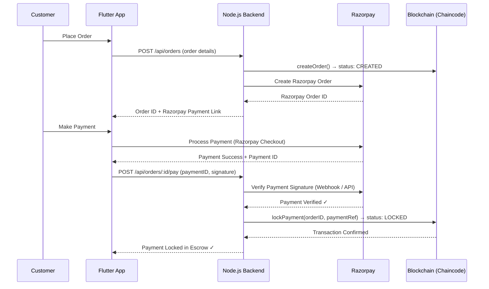
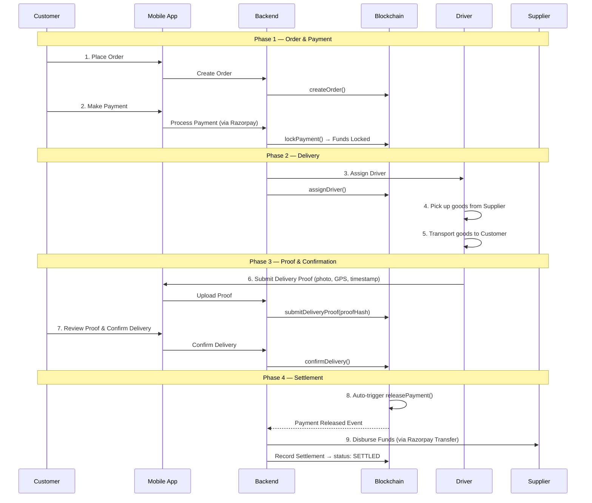
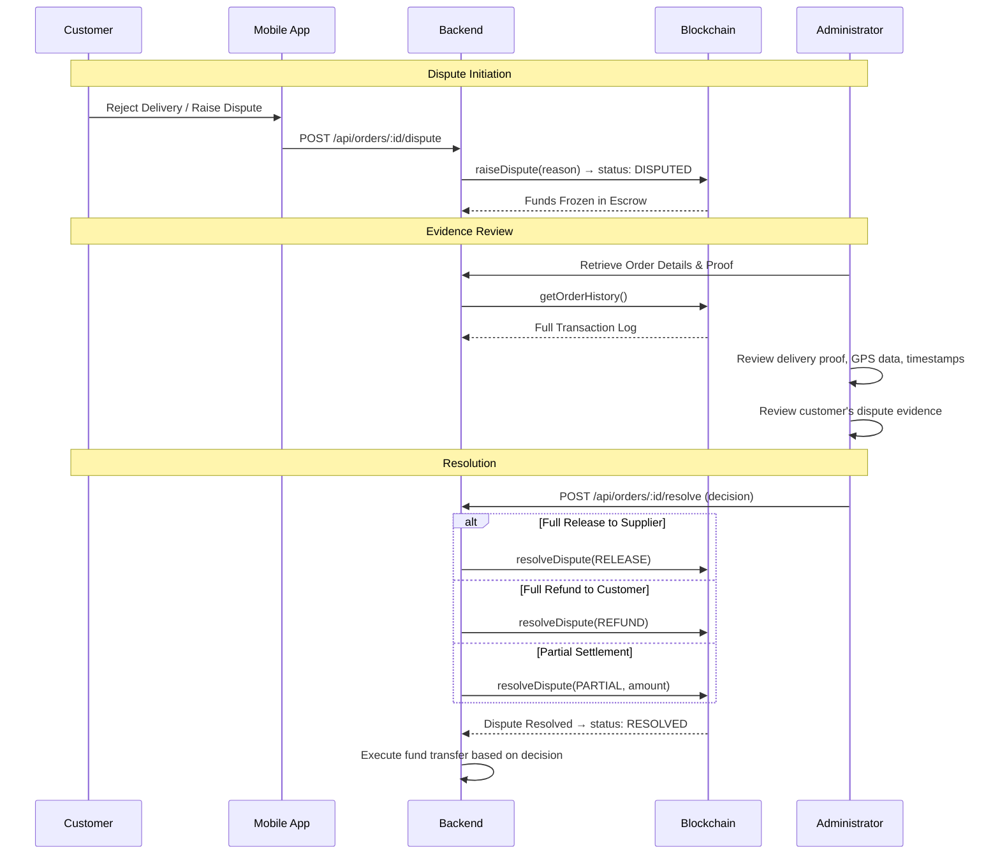
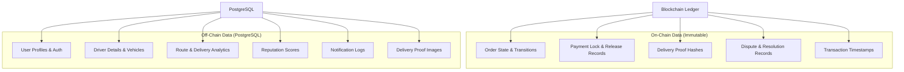
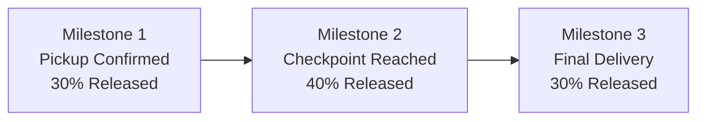

# Smart Contract-Based Escrow Payment System for Transportation Apps

> A comprehensive technical summary covering architecture, workflow, technologies, and implementation logic — suitable for hackathon documentation, technical reports, and academic project submissions.

---

## 1. Background and Motivation

In modern transportation, logistics, and infrastructure delivery ecosystems, financial transactions between **customers, contractors, suppliers, and drivers** are fraught with systemic inefficiencies:

| Problem | Impact |
|---|---|
| **Delayed settlements** | Suppliers and drivers face cash-flow uncertainty, discouraging reliable participation. |
| **Post-delivery disputes** | Customers may contest delivery quality or completeness after goods have already been received. |
| **Lack of trust** | No single party trusts the other to act in good faith without oversight. |
| **Manual verification** | Delivery records are maintained in centralized, editable databases susceptible to tampering. |
| **Record manipulation** | Centralized intermediaries can alter timestamps, delivery proofs, or payment statuses. |

Traditional payment pipelines rely on **centralized intermediaries** (banks, payment aggregators, manual reconciliation teams) that introduce single points of failure, latency, and opacity. Any participating party can delay payment, manipulate records, or unilaterally dispute a delivery with little accountability.

### The Blockchain Escrow Solution

A **blockchain-based escrow system** eliminates these problems by introducing a **smart contract** — a self-executing program deployed on a distributed ledger — that acts as a **trustless intermediary**. Instead of relying on a third party to hold and release funds, the smart contract:

- **Temporarily locks funds** upon order placement.
- **Enforces predefined release conditions** (e.g., delivery proof + customer confirmation).
- **Automatically settles payment** when all conditions are satisfied.
- **Records every state transition** as an immutable, auditable ledger entry.

**Key properties of blockchain that enable this:**

| Property | Benefit |
|---|---|
| **Immutability** | Once a transaction is recorded, it cannot be altered or deleted. |
| **Transparency** | All participants can verify the current state of any escrow transaction. |
| **Security** | Cryptographic guarantees ensure that only authorized parties can invoke state transitions. |
| **Automated Settlement** | Smart contract logic executes deterministically — no human intervention required for payment release. |

This approach **eliminates the need for a trusted third party**, reduces settlement time from days to seconds, and creates a tamper-proof audit trail for every transaction.

---

## 2. Problem Statement and Objectives

### Problem Statement

Current transportation and delivery payment systems suffer from:

1. **Opaque payment flows** where customers cannot verify when or if suppliers are paid.
2. **No automated enforcement** of delivery-to-payment linkage — payment release is manual and discretionary.
3. **Dispute resolution is subjective** and centralized, with no verifiable evidence chain.
4. **No immutable record** of delivery events, making post-hoc audits unreliable.

### Project Objective

Design and implement a **smart contract-based escrow payment system** for transportation and delivery applications that:

- **Locks payment** when an order is placed, preventing premature access by either party.
- **Accepts delivery proof** submitted by the driver (photographs, GPS coordinates, timestamps, digital signatures).
- **Requires customer confirmation** before releasing funds.
- **Automatically releases payment** to the supplier upon confirmed delivery.
- **Maintains transparent, immutable transaction logs** on the blockchain for every state transition.
- **Provides admin-based dispute resolution** with evidence review when delivery confirmation is contested.

---

## 3. System Actors and Roles

The system defines four primary actors, each with distinct responsibilities:

### 3.1 Customer

- Places orders through the mobile application.
- Deposits payment into the escrow smart contract at booking time.
- Reviews delivery proof submitted by the driver.
- Confirms delivery completion (triggering automatic payment release) **or** raises a dispute.

### 3.2 Supplier

- Provides the goods or services to be delivered.
- Receives payment automatically once the escrow contract releases funds after delivery confirmation.
- Can view transaction status and payment history on the blockchain ledger.

### 3.3 Driver / Logistics Provider

- Assigned to transport goods from supplier to customer.
- Submits **delivery proof** to the blockchain: photographs, GPS coordinates, timestamps, or digital signatures.
- Cannot access or influence the escrowed funds directly.

### 3.4 Administrator

- A trusted authority with elevated permissions in the smart contract.
- Activated **only** when a dispute is raised.
- Reviews delivery evidence (proof submitted by the driver, customer claims).
- Decides the payment outcome: **full release to supplier**, **full refund to customer**, or **partial settlement**.



---

## 4. Core Functional Requirements

### 4.1 Escrow Wallet Creation

- A **smart contract-based escrow wallet** is created for each order.
- The wallet holds payment securely until all delivery conditions are satisfied.
- Neither the customer nor the supplier can unilaterally withdraw funds from the escrow.

### 4.2 Payment Locking

- When a booking is confirmed, the customer's payment is **locked in the escrow smart contract**.
- The lock is enforced at the contract level — no external actor can release funds without satisfying the contract's conditions.
- Payment locking is recorded as an **immutable blockchain transaction**.

### 4.3 Delivery Proof Submission

The driver submits proof of delivery, which may include:

| Proof Type | Description |
|---|---|
| **Photographs** | Images of delivered goods at the destination. |
| **GPS Coordinates** | Geolocation data confirming the driver reached the delivery address. |
| **Timestamps** | Blockchain-recorded time of delivery event. |
| **Digital Signatures** | Cryptographic signature from the driver's device confirming delivery action. |

Proof metadata is stored on-chain (hashes, timestamps), while large binary data (images) is stored off-chain with on-chain hash references for integrity verification.

### 4.4 Delivery Confirmation

- The customer reviews the delivery proof through the application interface.
- Upon confirmation, the smart contract transitions the order status to **CONFIRMED**.
- This triggers the automatic payment release function.

### 4.5 Automatic Payment Release

- Once delivery is confirmed, the smart contract **automatically releases the locked payment** to the supplier's wallet.
- No manual intervention is required — the release is deterministic and enforced by contract logic.
- The release transaction is recorded on the blockchain ledger.

### 4.6 Immutable Transaction Logs

Every event in the order lifecycle is recorded as an immutable blockchain transaction:

1. **Order Creation** — Order details, participants, amount.
2. **Payment Locking** — Funds locked in escrow, transaction hash.
3. **Delivery Proof Submission** — Proof hashes, timestamps, driver identity.
4. **Delivery Confirmation** — Customer confirmation event.
5. **Payment Release** — Funds transferred to supplier, final settlement record.
6. **Dispute Events** — Dispute raised, evidence reviewed, resolution outcome.

### 4.7 Dispute Resolution

- If the customer contests the delivery, a **dispute** is raised through the application.
- The smart contract transitions the order to a **DISPUTED** state, freezing funds.
- The administrator reviews:
  - Delivery proof submitted by the driver.
  - Customer's dispute claim and supporting evidence.
  - Blockchain transaction logs for the order.
- The administrator invokes one of three resolution functions:
  - **`resolveRelease()`** — Full payment release to supplier.
  - **`resolveRefund()`** — Full refund to customer.
  - **`resolvePartial(amount)`** — Partial payment to supplier, remainder refunded.

---

## 5. Technical Architecture

### 5.1 Architecture Overview



### 5.2 Blockchain Network — Hyperledger Fabric

| Aspect | Detail |
|---|---|
| **Platform** | Hyperledger Fabric (permissioned blockchain) |
| **Consensus** | Raft-based ordering service |
| **Channels** | Dedicated channel for escrow transactions |
| **Peer Nodes** | Organization peers for each stakeholder type |
| **Identity** | Fabric CA (Certificate Authority) for participant identity management |

**Why Hyperledger Fabric over public blockchains?**

- **No cryptocurrency required** — transactions use fiat currency processed through traditional payment gateways.
- **Permissioned access** — only authorized participants can read/write to the ledger.
- **High throughput** — enterprise-grade performance suitable for real-time transportation transactions.
- **Privacy** — private data collections allow sensitive information to be shared only with authorized parties.

### 5.3 Smart Contract (Chaincode)

The escrow logic is implemented as **Chaincode** (Hyperledger Fabric's smart contract format), written in **Go** or **JavaScript**. Key functions:

```
┌─────────────────────────────────────────────────────┐
│              ESCROW CHAINCODE FUNCTIONS              │
├─────────────────────────────────────────────────────┤
│                                                     │
│  createOrder(orderID, customer, supplier, amount)   │
│    → Creates a new order, status: CREATED           │
│                                                     │
│  lockPayment(orderID, paymentRef)                   │
│    → Locks payment in escrow, status: LOCKED        │
│                                                     │
│  assignDriver(orderID, driverID)                    │
│    → Assigns driver, status: IN_TRANSIT             │
│                                                     │
│  submitDeliveryProof(orderID, proofHash, gps, ts)   │
│    → Records proof, status: PROOF_SUBMITTED         │
│                                                     │
│  confirmDelivery(orderID, customerID)               │
│    → Customer confirms, status: CONFIRMED           │
│    → Auto-triggers releasePayment()                 │
│                                                     │
│  releasePayment(orderID)                            │
│    → Releases funds to supplier, status: SETTLED    │
│                                                     │
│  raiseDispute(orderID, reason)                      │
│    → Freezes funds, status: DISPUTED                │
│                                                     │
│  resolveDispute(orderID, decision, amount)           │
│    → Admin resolves, status: RESOLVED               │
│                                                     │
│  getOrderHistory(orderID)                           │
│    → Returns full transaction log for the order     │
│                                                     │
└─────────────────────────────────────────────────────┘
```

**Order State Machine:**



### 5.4 Node.js Backend Server

The backend serves as the **API gateway** bridging the mobile application and the blockchain network.

**Responsibilities:**

| Module | Function |
|---|---|
| **REST API Layer** | Express.js endpoints for order management, user operations, and delivery tracking. |
| **Authentication** | JWT-based authentication with role-based access control (Customer, Driver, Supplier, Admin). |
| **Payment Gateway** | Razorpay SDK integration for payment processing and webhook verification. |
| **Fabric SDK Client** | Invokes chaincode functions via Hyperledger Fabric SDK (`fabric-network` npm package). |
| **Business Logic** | Order validation, driver assignment algorithms, notification dispatch. |
| **File Upload** | Handles delivery proof image uploads, stores files, and computes hashes for on-chain storage. |

**Key API Endpoints:**

```
POST   /api/orders              → Create a new order
POST   /api/orders/:id/pay      → Process payment and lock in escrow
POST   /api/orders/:id/assign   → Assign driver to order
POST   /api/orders/:id/proof    → Submit delivery proof
POST   /api/orders/:id/confirm  → Confirm delivery
POST   /api/orders/:id/dispute  → Raise a dispute
POST   /api/orders/:id/resolve  → Admin resolves dispute
GET    /api/orders/:id          → Get order details
GET    /api/orders/:id/history  → Get blockchain transaction log
GET    /api/users/:id/orders    → Get user's orders
```

### 5.5 Flutter Mobile Application

A cross-platform mobile application built with **Flutter (Dart)** providing interfaces for:

**Customer Interface:**
- Browse and place orders.
- Make payments (integrated with Razorpay).
- Track delivery in real-time.
- View delivery proof.
- Confirm delivery or raise dispute.
- View payment and transaction history.

**Driver Interface:**
- View assigned deliveries.
- Navigate to pickup and delivery locations.
- Upload delivery proof (camera, GPS capture).
- View earnings and settlement history.

**Admin Interface (Web or Mobile):**
- Review disputed orders.
- View delivery evidence and blockchain logs.
- Resolve disputes with settlement decisions.

### 5.6 PostgreSQL Database (Off-Chain Storage)

| Table | Data Stored |
|---|---|
| `users` | User profiles, roles, authentication credentials. |
| `drivers` | Driver details, vehicle information, availability status. |
| `orders_metadata` | Route information, estimated delivery times, special instructions. |
| `delivery_analytics` | Delivery performance metrics, average times, success rates. |
| `reputation_scores` | Driver and supplier ratings based on delivery history. |
| `proof_files` | File paths and metadata for uploaded delivery proof images. |
| `notifications` | Push notification logs and delivery status updates. |

> [!NOTE]
> The PostgreSQL database stores **off-chain metadata** only. All payment states, escrow locks, delivery confirmations, and settlement records are stored **on-chain** in the Hyperledger Fabric ledger. The off-chain database handles data that does not require immutability guarantees.

### 5.7 Web3 API Integration Layer

The integration layer provides a **secure bridge** between the Node.js backend and the blockchain network:

- **Transaction Signing** — Signs blockchain transactions using enrolled user identities from Fabric CA.
- **Event Listening** — Subscribes to chaincode events (payment locked, delivery confirmed, dispute raised) and triggers backend workflows.
- **Ledger Queries** — Retrieves order history and current state from the blockchain world state and transaction log.
- **Connection Pooling** — Manages gateway connections to Fabric peers for efficient transaction throughput.

---

## 6. Payment Processing with Razorpay

The payment flow combines a **traditional payment gateway** (Razorpay) with **blockchain escrow logic**:



**Key Points:**

1. **Razorpay handles the actual fund transfer** from the customer's bank account / card / UPI.
2. **The backend verifies payment** via Razorpay's webhook or signature verification API.
3. **After verification**, the backend invokes `lockPayment()` on the blockchain, transitioning the order to **LOCKED** state.
4. **Funds are logically locked** — the blockchain state prevents any release until delivery conditions are met.
5. **Actual fund disbursement** to the supplier can be triggered via Razorpay's Route / Transfer API upon blockchain settlement confirmation.

---

## 7. End-to-End Workflow

### 7.1 Normal Delivery Flow (Happy Path)



**Step-by-Step Breakdown:**

| Step | Actor | Action | Blockchain State |
|---|---|---|---|
| 1 | Customer | Places order via mobile app | `CREATED` |
| 2 | Customer | Pays via Razorpay; backend locks payment in escrow | `LOCKED` |
| 3 | System | Assigns available driver to the order | `IN_TRANSIT` |
| 4 | Driver | Picks up goods from supplier location | `IN_TRANSIT` |
| 5 | Driver | Transports goods to customer's delivery address | `IN_TRANSIT` |
| 6 | Driver | Submits delivery proof (photos, GPS, timestamp) | `PROOF_SUBMITTED` |
| 7 | Customer | Reviews proof and confirms successful delivery | `CONFIRMED` |
| 8 | Smart Contract | Automatically releases locked payment | `SETTLED` |
| 9 | Backend | Disburses funds to supplier via payment gateway | `SETTLED` |

### 7.2 Dispute Resolution Flow (Alternate Path)



---

## 8. Technology Stack Summary

| Layer | Technology | Purpose |
|---|---|---|
| **Mobile App** | Flutter (Dart) | Cross-platform customer & driver interfaces |
| **Backend Server** | Node.js (Express.js) | REST API gateway, business logic, orchestration |
| **Blockchain** | Hyperledger Fabric | Permissioned ledger for escrow transactions |
| **Smart Contract** | Chaincode (Go / JavaScript) | Escrow logic, state management, payment release |
| **Database** | PostgreSQL | Off-chain metadata, analytics, user profiles |
| **Payment Gateway** | Razorpay | Fiat payment processing, webhook verification |
| **Identity Management** | Hyperledger Fabric CA | X.509 certificate-based identity for blockchain participants |
| **File Storage** | Cloud Storage (AWS S3 / Firebase) | Delivery proof images and documents |
| **Blockchain SDK** | `fabric-network` (npm) | Node.js client for invoking chaincode |
| **Authentication** | JWT + OAuth 2.0 | API authentication and role-based access control |
| **Real-time Updates** | WebSocket / Firebase FCM | Push notifications for order and delivery status |

---

## 9. Data Flow Summary



**Guiding Principle:** Data requiring **immutability, auditability, and trust** is stored on-chain. Data requiring **fast queries, complex analytics, and large storage** is stored off-chain.

---

## 10. Optional and Advanced Features

### 10.1 Smart Contract-Based Penalties for Delayed Delivery

- Define **SLA (Service Level Agreement) thresholds** in the smart contract (e.g., delivery within 24 hours).
- If the driver exceeds the threshold, the contract automatically applies a **penalty deduction** from the supplier's payment.
- Penalty amounts and conditions are encoded in the chaincode, ensuring transparent and automated enforcement.

### 10.2 Multi-Stage Milestone Payments

For **large infrastructure or logistics projects** involving multiple delivery phases:

- Payment is split into **milestones** (e.g., 30% on pickup, 40% on mid-route checkpoint, 30% on final delivery).
- Each milestone has its own **proof submission and confirmation cycle**.
- The smart contract releases the corresponding payment fraction upon each milestone completion.



### 10.3 AI-Based Fraud Detection

- Train machine learning models on historical delivery data to identify **anomalous patterns**:
  - GPS coordinates that don't match the delivery route.
  - Delivery proof images that are recycled from previous orders.
  - Unusually fast delivery times suggesting proof fabrication.
- Flag suspicious transactions for **automatic admin review** before payment release.

### 10.4 Reputation Scoring System

- Maintain a **reputation score** for each driver and supplier based on:

| Factor | Weight |
|---|---|
| Successful deliveries | +ve |
| Customer confirmations without dispute | +ve |
| Disputes raised against them | −ve |
| Delivery delays | −ve |
| Admin resolutions in their favor | +ve |

- Scores influence **driver assignment priority** — higher-rated drivers get priority for high-value orders.
- Scores are stored off-chain (PostgreSQL) with aggregate summaries anchored on-chain for tamper resistance.

### 10.5 Automated Delivery Confirmation via IoT

- Integrate with **IoT devices** (smart locks, GPS trackers, weight sensors) to automatically confirm delivery without customer intervention.
- IoT device data is hashed and submitted as delivery proof directly to the blockchain.

### 10.6 Cross-Border Payment Support

- Extend the system to support **multi-currency settlements** using payment gateway features or stablecoin integrations.
- Smart contract handles **currency conversion logic** or delegates to an off-chain oracle service.

---

## 11. Security Considerations

| Threat | Mitigation |
|---|---|
| **Unauthorized access to escrow** | Role-based access control enforced at chaincode level; only authorized identities can invoke state transitions. |
| **Delivery proof tampering** | Proof hashes stored on-chain; any modification to off-chain proof files is detectable via hash mismatch. |
| **Replay attacks** | Each transaction includes unique order IDs and nonces; duplicate submissions are rejected by chaincode. |
| **Payment gateway fraud** | Razorpay webhook signature verification ensures payment confirmation authenticity. |
| **Admin collusion** | Multi-signature dispute resolution (requiring multiple admin approvals) can be implemented for high-value orders. |
| **Data privacy** | Hyperledger Fabric's private data collections ensure sensitive data is shared only with authorized channel members. |

---

## 12. Conclusion

The **Smart Contract-Based Escrow Payment System for Transportation Apps** addresses the fundamental trust deficit in transportation payment workflows by leveraging blockchain's core properties — **immutability, transparency, and automated execution**. By replacing centralized intermediaries with deterministic smart contract logic, the system ensures that:

- **Payments are fair** — funds are locked until delivery is proven and confirmed.
- **Records are tamper-proof** — every transaction is an immutable blockchain entry.
- **Disputes are evidence-based** — administrators resolve conflicts using verifiable on-chain data.
- **Settlement is instant** — no manual reconciliation or delayed bank transfers.

The combination of **Hyperledger Fabric** for enterprise-grade blockchain, **Node.js** for scalable backend services, **Flutter** for cross-platform mobile access, **PostgreSQL** for off-chain analytics, and **Razorpay** for fiat payment processing creates a robust, production-ready architecture that can be deployed across transportation, logistics, and infrastructure delivery domains.

---

*Project: Smart Contract-Based Escrow Payment System for Transportation Apps*
*Document Type: Technical Summary — Hackathon / Academic / Technical Report*
